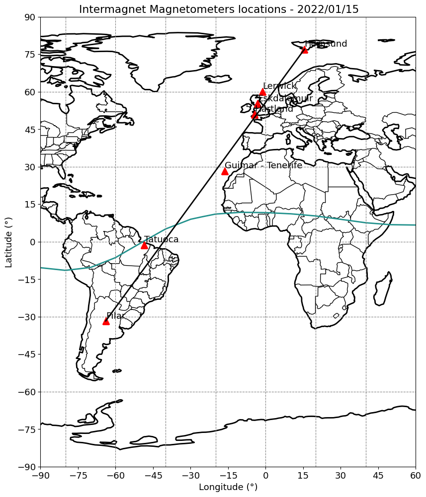
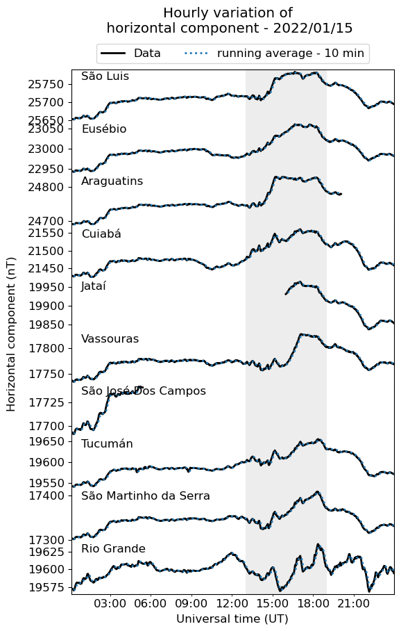
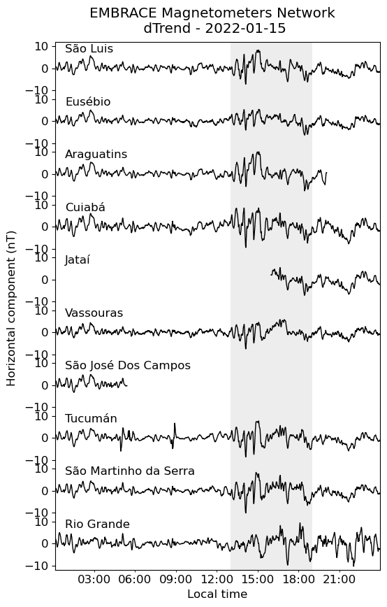
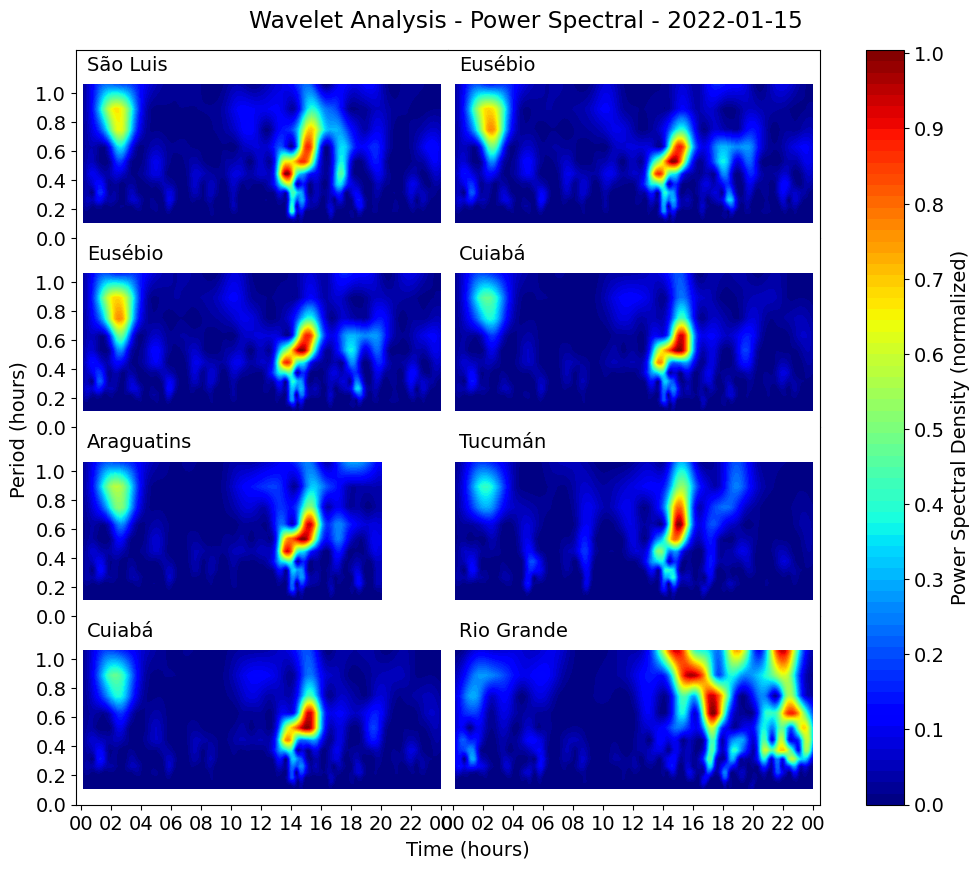
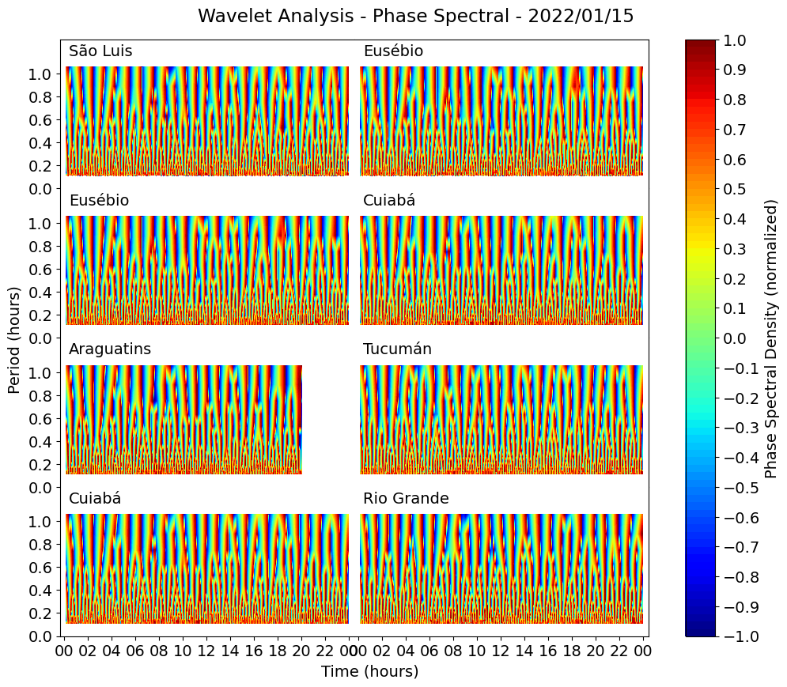
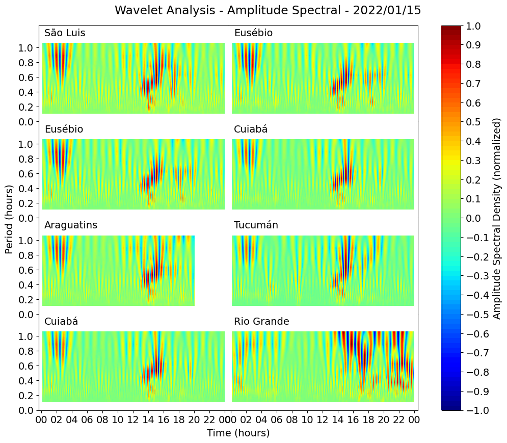

```python
from MagnetometersAnalysis import *
```

<div></div>

# EMBRACE Magnetometers Analysis

## Luiz Fillip

See EMBRACE description: http://www2.inpe.br/climaespacial/portal/magnetometer-about/

Magnetometer measures the strength and sometimes the direction of a magnetic field. An important use is the magnetometer for measuring the earth's magnetic field. By detecting irregularities in the Earth's magnetic field, a magnetometer may indicate the location of magnetic ore deposits such as iron ore, or geological formations associated with oil.


## Sites Locations and Hourly Variation of  Horizontal Component


<table>
  <tr>
  </tr>
  <tr>
    <td></td>
    <td></td>
  </tr>
 </table>
 
### Codes 

**AllSitesVariations.py and SitesLocations.py**

## dTrend Analysis

Removal the average (10 minutes) from the original data



## Wavelet Analysis

Wavelet analysis is becoming a common tool for analyzing localized variations of power within a time series. By decomposing a time series into time–frequency space, one is able to determine both the dominant modes of variability and how those modes vary in time (Torrence and Compo 1998). 

Wavelet Analysis Software from **Torrence and Compo 1998** 

see: http://atoc.colorado.edu/research/wavelets/

### Power Spectral 

INPUTS: $\Delta t = 0.016$ 



### Phase Spectral

We can compute the wavelet phase by $\arctan(\Im(z), \Re(z))$



### Amplitude Spectral



#### Python Code

We can compute the wavelet amplitude bu $\Re(z)$

Please include the following acknowledgement in any publication:

Python wavelet software provided by **Evgeniya Predybaylo** based on Torrence and Compo (1998) and is available at URL: "http://atoc.colorado.edu/research/wavelets/"
